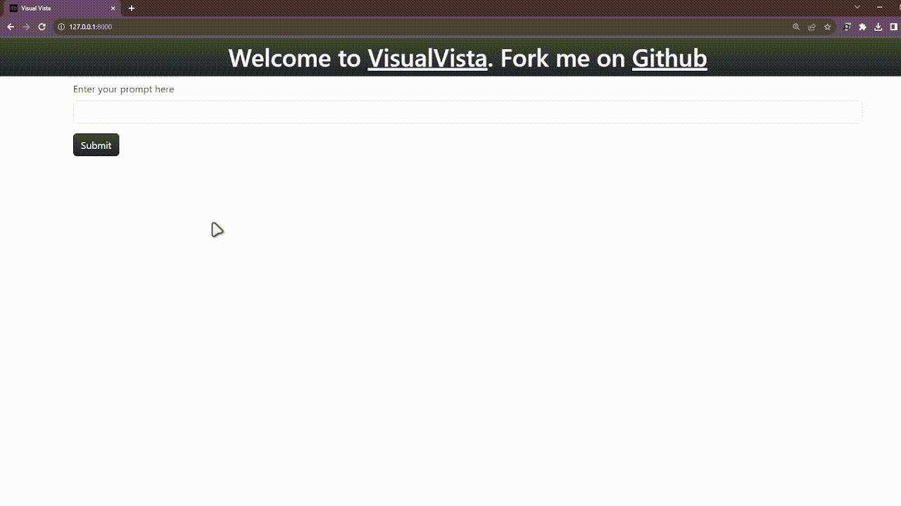

# VisualVista

A text to image project using openai dalle-2


## Run this project locally

Clone the project

```bash
  git clone https://link-to-project
```

Go to the project directory

```bash
  cd VisualVista
```

Install dependencies

```bash
  pip install -r requirements.txt
```

In views.py insert your OpenAI API Key

Start the server

```bash
  python3 manage.py runserver
```


## Features

- Can generate amazing pictures
- 404 page avaliable
- Link of Image
- Using Dalle-2 model
## Demo


# Thank You

